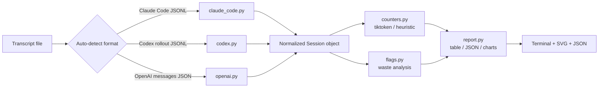

<div align="center">

# 🔍 tokenauditor

**Know where your AI agent's token budget went.**

A local, read-only CLI that audits recorded agent transcripts — Claude Code, OpenAI, and Codex — and reports a per-turn token breakdown plus waste flags.

[](https://www.python.org/downloads/)
[](LICENSE)
[]()
[]()

</div>

---

## Why tokenauditor exists

Agent sessions are expensive, but the bill is a black box. Token usage is reported as a single number at the end of a run, with no hint of whether the cost came from:

- a bloated system prompt,
- oversized tool definitions,
- repeated identical tool calls,
- a single massive tool result dwarfing everything else, or
- unchecked context growth across turns.

**tokenauditor parses the actual transcript** and tells you, in seconds, exactly where the budget went. It runs entirely offline, needs no API keys, and never modifies your source file.

---

## What you get

| Output | Description |
|--------|-------------|
| **Reported totals** | Provider-issued `input` / `output` / cache usage summed across turns |
| **Estimated breakdown** | `system+tools` · `user` · `assistant` · `thinking` · `tool_use_args` · `tool_results` |
| **Per-turn table** | Input composition and newly added content per assistant turn (`--by-turn`) |
| **Waste flags** | `HEAVY_TOOL_RESULT`, `CONTEXT_GROWTH`, `REPEAT_TOOL_CALL` |
| **SVG charts** | `bar.svg` + `area.svg` written to any directory (`--charts`) |
| **Machine-readable JSON** | Full report for CI or dashboards (`--json`) |

---

## Quick start

```bash
# Install
pipx install git+https://github.com/Victorchatter/Tokenauditor.git
# or, from a local clone: pipx install .

# Audit a Claude Code session
tokenauditor ~/.claude/projects/my-project/2026-07-22-session.jsonl

# Full report with per-turn detail and charts
tokenauditor session.jsonl --by-turn --charts ./charts
```

---

## Installation

Requires **Python 3.9+**.

```bash
pipx install git+https://github.com/Victorchatter/Tokenauditor.git
```

From a local clone instead:

```bash
pip install .
```

> **Offline note:** `tiktoken` downloads its BPE table the first time it tokenizes text. After one successful run the table is cached locally. On a fully air-gapped machine where the download cannot happen, tokenauditor transparently falls back to a documented `~4 chars/token` heuristic and labels all estimates `(approx, heuristic (offline))`. The numbers are never silently wrong.

---

## Usage

```bash
tokenauditor <file>              # summary table + waste flags (default)
tokenauditor <file> --by-turn    # summary + per-turn table
tokenauditor <file> --flags      # waste flags only
tokenauditor <file> --json       # machine-readable JSON report
tokenauditor <file> --charts out # write SVG charts to out/
```

### Supported transcript formats

| Format | File pattern | Input recognized |
|--------|--------------|------------------|
| **Claude Code JSONL** | `~/.claude/projects/<proj>/<session>.jsonl` | `user` and `assistant` records with Anthropic `usage` |
| **Codex rollout JSONL** | OpenAI Codex rollout logs | `session_meta` + `response_item` + `event_msg` lines |
| **OpenAI messages JSON** | `[{...}]` or `{"messages": [...], "tools": [...]}` | `system` / `user` / `assistant` / `tool` roles |

Format is auto-detected from the first non-blank line — no manual flags needed.

### Provider token accounting

The three parsers surface different things, because each transcript format records different fields. This is what tokenauditor actually reads (not what the provider's API accepts):

| Field | Claude Code JSONL | OpenAI messages | Codex traces |
|---|---|---|---|
| Per-turn input/output tokens | **reported** (from Anthropic `usage`) | **estimated** (no `usage` object in the file) | **reported** (from `token_count` events) |
| Cache creation / read tokens | yes (`cache_creation_input_tokens`, `cache_read_input_tokens`) | n/a | n/a |
| System prompt + tool defs prefix | inferred (first turn's input − first user message) | counted directly (`tools` JSON + `system` text) | counted (`base_instructions` + `system` text) |
| Thinking / reasoning tokens | yes (`thinking` blocks) | no | yes (`reasoning` summary) |
| Tool-call args + results | yes | yes | yes |
| Tool-name attribution | `tool_use_id` / `toolUseResult` | `tool_call_id` | `call_id` |
| Reported input/output totals | input + output | estimated only | input + output |

The OpenAI column is estimation-only because a serialized `messages` array carries no `usage` block — tokenauditor counts the visible text/tools instead and labels the result accordingly. Claude Code and Codex both carry per-turn usage, so their numbers are reported, not estimated.

---

## Example output

```text
tokenauditor - claude_code, 306 turn(s)

  Reported total input  (sum over turns): 30,744,786
  Reported total output:                  269,844
  System+tools prefix:                    ~41,047  (inferred)

  Estimated breakdown (approx, tiktoken):
    system+tools_prefix    ~    41,047
    user_text              ~    11,569
    assistant_text         ~     2,460
    thinking              ~         0
    tool_use_args         ~    50,321
    tool_results          ~ 1,120,033  <-- largest
    ----------------------------------
    total_visible         ~ 1,225,430

  Flags:
    HEAVY_TOOL_RESULT: Read result ~102284tok > all user turns combined (~11569tok) at turn 225
    CONTEXT_GROWTH: context grew ~1500tok -> ~28000tok (18.7x) from first to last quarter
    REPEAT_TOOL_CALL: Read called 3 times with identical input (first at turn 7)
```

---

## Visual reports

`--charts <dir>` emits two self-contained SVG files. They use a light, color-vision-deficiency-friendly palette and render inline on GitHub or in any browser.

### Token budget by category (`bar.svg`)

Horizontal bar chart of the estimated breakdown. The largest category is highlighted in blue — usually the first place to optimize.


### Context composition over time (`area.svg`)

Stacked area chart showing how reported input tokens are composed per turn: cached prefix re-sent, newly written to cache, and fresh uncached input. Only rendered for transcripts that carry per-turn usage (Claude Code / Codex).


---

## How it works



### Two counts, on purpose

A recorded Claude Code transcript does **not** store the system prompt or tool definitions as discrete records. They live inside Anthropic's cached prefix, reported only as aggregate per-turn `usage` fields. So tokenauditor deliberately exposes two parallel, clearly labeled counts rather than inventing a single fiction:

1. **Reported totals** — authoritative provider numbers.
   - `total_input = input_tokens + cache_creation_input_tokens + cache_read_input_tokens`
   - `output = output_tokens (+ reasoning_output_tokens for Codex)`
2. **Estimated breakdown** — `tiktoken` (`cl100k_base`) over visible content blocks, categorized.
   - Exact for OpenAI transcripts.
   - Approximate for Anthropic / Codex content, labeled `(approx, tiktoken)`.
3. **Inferred prefix** — for Claude Code, the system + tools size is inferred as `first_turn_total_input − first_user_message_tokens` and labeled `(inferred)`.

For OpenAI messages JSON, the system prompt and tool definitions are present as records, so the estimated breakdown is exact and no inference is needed.

### Category definitions

| Category | Claude Code source | Codex source | OpenAI source |
|----------|-------------------|--------------|---------------|
| `system+tools_prefix` | inferred from first turn | `session_meta.base_instructions.text` | `role: system` messages + `tools` array |
| `user_text` | `user` text content | `message` role `user` text | `role: user` content |
| `assistant_text` | `assistant` text blocks | `assistant` output text | `role: assistant` content |
| `thinking` | `assistant` thinking blocks | `reasoning` summary text | — |
| `tool_use_args` | `tool_use` `input` | `function_call` `arguments` | `tool_calls[].function.arguments` |
| `tool_results` | `tool_result` content | `function_call_output` | `role: tool` content |

---

## Waste flags

| Flag | Rule | Why it matters |
|------|------|----------------|
| **HEAVY_TOOL_RESULT** | A single tool result is larger than all user text turns combined | Usually the biggest optimization target — e.g., reading an entire file when only a slice is needed |
| **CONTEXT_GROWTH** | Reported `total_input` median grows > 2× from first quarter to last quarter (requires ≥4 turns with usage) | Context is ballooning; you may be carrying redundant history or repeated tool results |
| **REPEAT_TOOL_CALL** | Same tool called ≥2 times with identical canonical JSON input | Indicates missed memoization or redundant exploration |

---

## Use cases

- **Agent developers** — profile a long Claude Code session and find the one `Read` result that ate 90% of the budget.
- **Tool authors** — prove that a new tool's output is disproportionately expensive.
- **CI / regression testing** — run `tokenauditor <fixture> --json` in a pipeline and assert that `tool_results` does not exceed a threshold.
- **Cost reviews** — generate `bar.svg` + `area.svg` for a post-mortem slide deck.
- **Offline audits** — inspect sensitive transcripts on an air-gapped machine without sending data anywhere.

---

## Accuracy & limitations

- **Read-only guarantee** — the transcript file is opened in `r` mode only; `selfcheck.py` asserts the bytes are unchanged after a run.
- **No telemetry / no network** — except the optional one-time `tiktoken` BPE download on first use.
- **Claude Code prefix inference** conflates the system prompt and tool definitions into one bucket because the transcript format does not separate them.
- **Codex token counts** may report only `total_tokens` with subfields zero; in that case `total_input` stays zero and `CONTEXT_GROWTH` will not fire, which is the honest behavior.
- **OpenAI** transcripts have no per-turn usage, so per-turn tables show estimated content only and `CONTEXT_GROWTH` is intentionally skipped.

---

## Development

```bash
# Run the no-framework self-test
python selfcheck.py

# Install in editable mode
pipx install -e .   # or: pip install -e .

# Run against a sample transcript
tokenauditor sample.jsonl --by-turn --charts ./charts
```

All source code includes `# ponytail:` comments wherever a deliberate short-term simplification was chosen, with the ceiling and the upgrade path spelled out.

---

## Project layout

```text
tokenauditor/
├── tokenauditor/
│   ├── cli.py              # argument parsing + orchestration
│   ├── counters.py         # tokenization (tiktoken / heuristic)
│   ├── flags.py            # waste-flag analysis
│   ├── report.py           # terminal table + JSON renderer
│   ├── charts.py           # SVG chart generators
│   ├── parsers/
│   │   ├── detect.py       # format auto-detection
│   │   ├── claude_code.py  # Claude Code JSONL parser
│   │   ├── codex.py        # Codex rollout JSONL parser
│   │   └── openai.py       # OpenAI messages JSON parser
│   ├── __init__.py
│   └── __main__.py         # python -m tokenauditor
├── selfcheck.py            # no-framework integration tests
├── pyproject.toml
├── LICENSE                 # MIT
└── README.md
```

---

## License

MIT — see [LICENSE](LICENSE).

---

<div align="center">

Built to make agent token costs observable.

</div>
